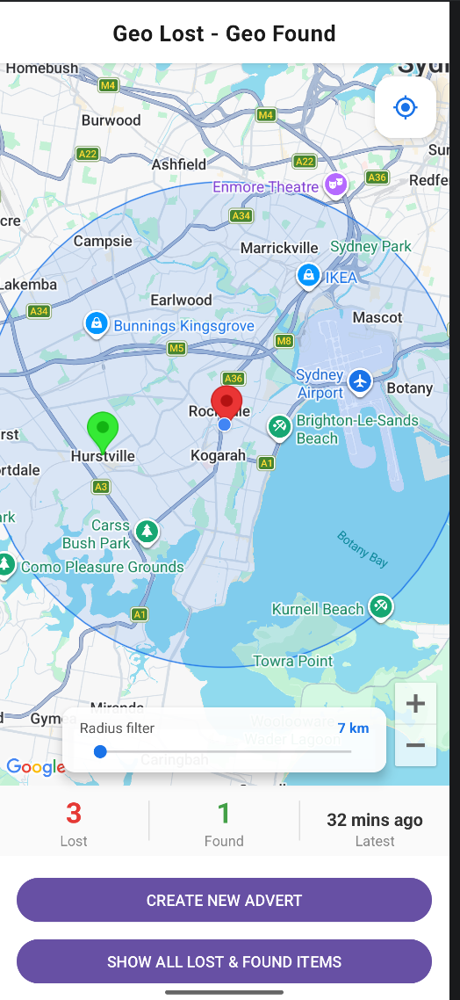
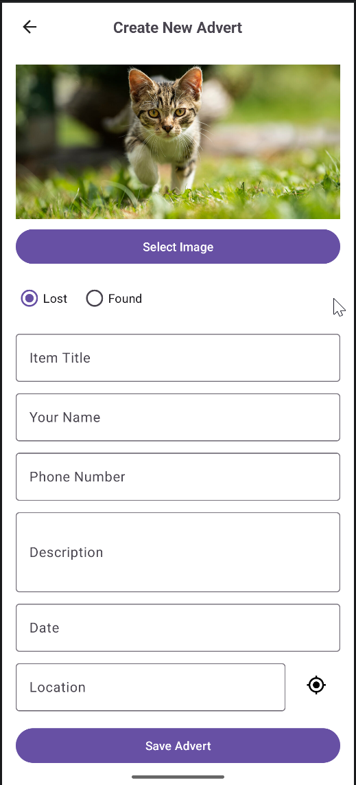
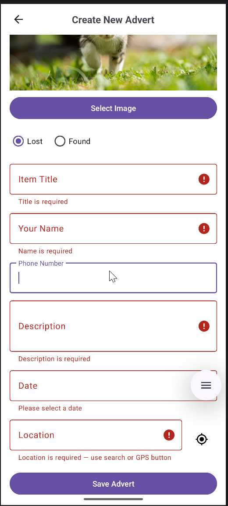
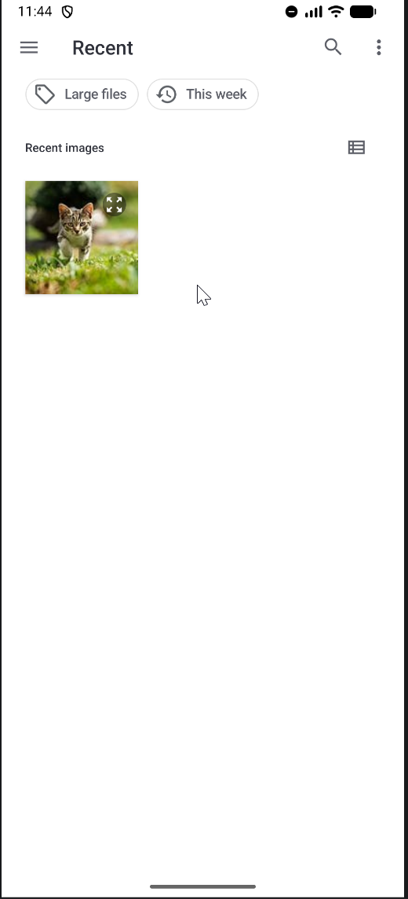
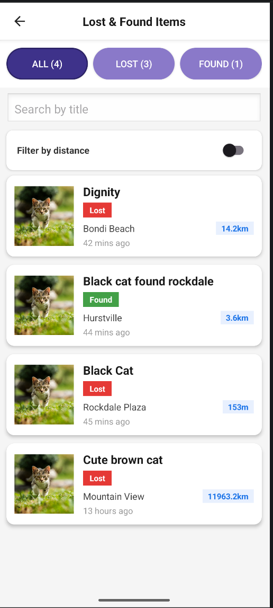
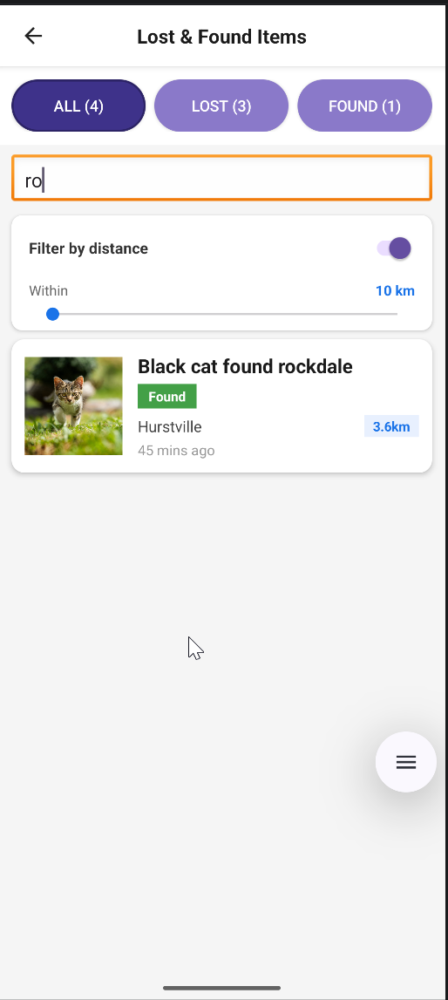
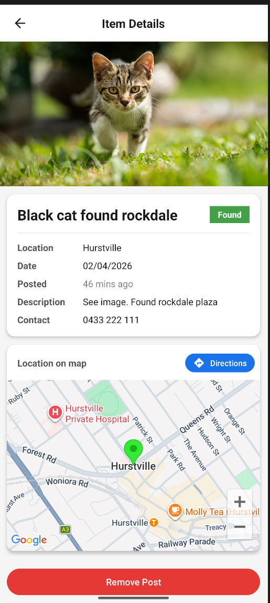
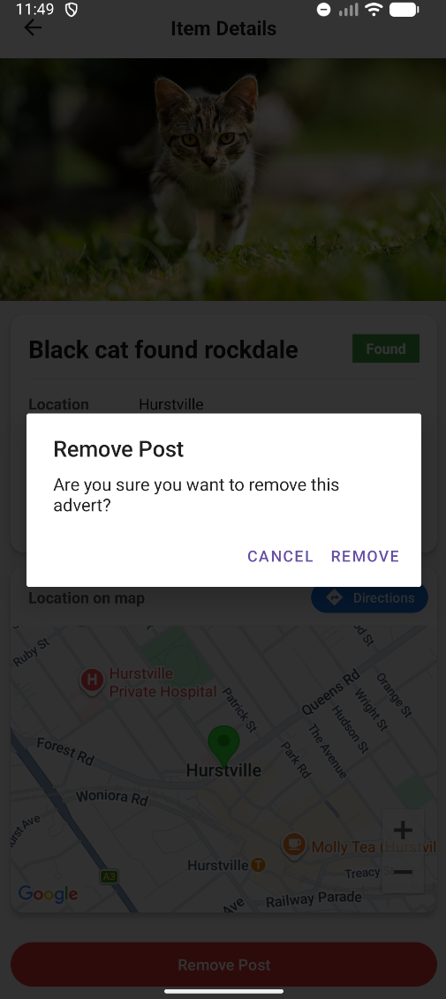

# LostFound Map — SIT305 Task 9.1P

An Android Lost & Found app with full geo features, built in Java using Android Studio.

---

## Features

### Core (Task 9.1P Requirements)

* **Google Maps** embedded on the home screen — all lost/found items displayed as map markers
  + 🔴 Red pin = Lost item
  + 🟢 Green pin = Found item
* **Places Autocomplete** — tap the location field to search and select any address
* **Get Current Location** — GPS button reverse-geocodes the user's position to a readable address
* **Radius filter** — SeekBar (1–50 km) with a live circle overlay filters which markers are shown based on distance from the user

### Beyond the Spec

* **Item list** with All / Lost / Found filter buttons, title search, and optional distance toggle filter
* **Item detail view** with embedded map pin, zoom controls, and "Get Directions" button (Found items only — opens Google Maps navigation)
* **Stats strip** on home screen showing live Lost count, Found count, and latest post date
* **Re-centre FAB** — snaps camera back to user's current location
* Full **form validation** — required fields, name rejects digits, phone rejects letters, inline error messages that collapse cleanly when corrected
* Card-based UI with Lost/Found colour badges throughout
* Persistable image URIs — images survive activity recreation

---

## Screens

| Screen | Description |
| --- | --- |
| `MainActivity` | Home — embedded map, radius SeekBar, stats strip, navigation buttons |
| `AddItemActivity` | Create advert — form with autocomplete location, GPS, date picker, image picker |
| `ItemListActivity` | Browse all adverts — filter by type, search by title, optional distance filter |
| `ItemDetailActivity` | Full detail — hero image, details card, location map, Get Directions |

---

## Screenshots

| | | |
|---|---|---|
|  |  |  |
| **Home** | **Create** | **Validation** |
|  |  |  |
| **Image Picker** | **Item List** | **Search And Filter** |
|  |  |  |
| **Detail** | **Remove** |  |


## Tech Stack

* **Language:** Java
* **Min SDK:** 26 | **Target SDK:** 36
* **Maps:** Google Maps SDK for Android (`play-services-maps:19.2.0`)
* **Location:** Google Play Services Location (`play-services-location:21.3.0`)
* **Places:** Google Places SDK (`places:3.5.0`)
* **Database:** SQLite via `SQLiteOpenHelper`
* **UI:** Material Design 3, CardView, RecyclerView, ConstraintLayout
* **Security:** `secrets-gradle-plugin` — API key injected at build time, never committed

---

## Project Structure

```
app/src/main/java/com/example/lostfound/
├── adapter/
│   └── ItemAdapter.java          # RecyclerView adapter with type badges
├── database/
│   └── DBHelper.java             # SQLite helper — CRUD + Haversine radius filter
├── model/
│   └── LostItem.java             # Data model with lat/lng + timestamp
├── util/
│   └── TimeUtils.java            # "X mins ago" timestamp formatter
├── AddItemActivity.java
├── ItemDetailActivity.java
├── ItemListActivity.java
└── MainActivity.java
```

---

## Setup

### Prerequisites

* Android Studio Hedgehog or later
* Google Cloud project with the following APIs enabled:
  + Maps SDK for Android
  + Places API
  + Geocoding API

### API Key

1. Create `secrets.properties` in the project root (already in `.gitignore`):

   ```
   MAPS_API_KEY=your_api_key_here
   ```
2. Create `local.defaults.properties` in the project root:

   ```
   MAPS_API_KEY=DEFAULT_API_KEY
   ```
3. Sync Gradle — the key is injected into the manifest at build time via `secrets-gradle-plugin`

### Build & Run

```
# Clone the repo
git clone https://github.com/P-the-B/SIT305_9.1P.git

# Open in Android Studio
# Sync Gradle
# Add secrets.properties with your Maps API key
# Run on emulator or physical device (API 26+)
```

---

## Database Schema

```
CREATE TABLE items (
    id            INTEGER PRIMARY KEY AUTOINCREMENT,
    title         TEXT,
    description   TEXT,
    date          TEXT,
    location_text TEXT,
    name          TEXT,
    phone         TEXT,
    is_lost       INTEGER,   -- 1 = Lost, 0 = Found
    image_uri     TEXT,
    latitude      REAL,
    longitude     REAL,
    timestamp     TEXT        -- ISO-8601: yyyy-MM-dd'T'HH:mm:ss
)
```

---

## AI Usage Declaration

This project was developed with assistance from Claude (Anthropic) as declared in the submission document. The developer acted as project manager, designer, and code reviewer. Claude assisted with code generation, debugging, and implementation suggestions. All AI usage is logged and linked in the submission document per Deakin University guidelines.

---

## Legal

This project was created for educational purposes as part of Deakin University's SIT305 unit. All rights reserved. Reuse, redistribution, or reproduction of any part of this codebase requires explicit written permission from the author.
